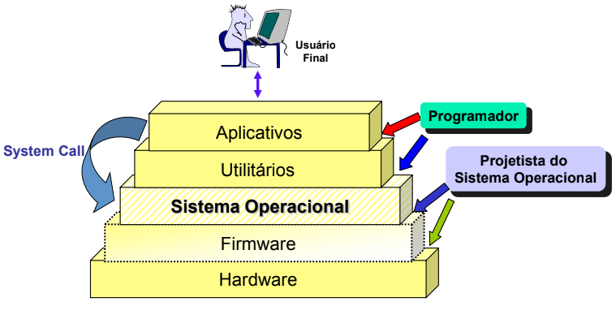

1. **Descreva como seria utilizar o computador sem um sistema operacional.**
Usar um computador seria extremamente complicado e limitado, pois o SO atua como uma ponte entre o hardware e o usuário, além de gerenciar todos os recursos do sistema. Sendo a principal dificuldade a falta de uma interface de controle

2. **Qual é a função de um sistema operacional?**
A função de um sistema operacional (SO) é atuar como uma interface entre o hardware do computador e o usuário, além de gerenciar os recursos do sistema para garantir que tudo funcione de maneira eficiente.

3. **Que tipo de dificuldade seria encontrado ao programar em um ambiente sem sistema operacional?**
Interação direta com o hardware, gerenciamento manual de memória, etc. Além de ter que programar em um nível extremamente baixo, o que tornaria o desenvolvimento de software muito mais complexo, demorado e propenso a erros

4. **Explique o que é conceito de máquina de camadas (níveis).**

É um modelo teórico utilizado para explicar a organização hierárquica de sistemas de computação, especialmente sistemas operacionais e arquitetura de computadores. A ideia central é que um computador pode ser visto como uma série de camadas ou níveis, onde cada camada superior depende da camada imediatamente abaixo para fornecer serviços ou abstrações, mas esconde os detalhes de implementação da camada inferior.

- Nível 0: Hardware (Circuitos e Eletrônica)
- Nível 1: Microprogramação (Firmware)
- Nível 2: Sistema Operacional
- Nível 3: Linguagens de Baixo Nível (Assembly)
- Nível 4: Linguagens de Programação de Alto Nível
- Nível 5: Aplicações

5. **Por que dizemos que há uma subutilização dos recursos em sistemas monoprogramáveis?**
Porque esses sistemas só permitem a execução de um único programa de cada vez. Esse modelo de operação deixa vários recursos do computador ociosos enquanto o programa em execução está aguardando por operações que não envolvem diretamente o processador, como entrada/saída (I/O)

6. **Com relação ao gerenciamento de processos em um sistema operacional, quais são os possíveis estados dos Processos Ativos. Explique o que ocorre em cada estado e suas transições.**

1. _Novo_ (New): O processo foi criado, mas ainda não está pronto para ser executado. Está sendo inicializado pelo sistema.
	- Transição: Quando a inicialização é concluída, o processo é movido para o estado "Pronto".
2. _Pronto_ (Ready): O processo está preparado para ser executado e está aguardando ser escalonado para a CPU.
	- Transição: O processo entra em execução quando o escalonador o escolhe para ocupar a CPU, passando para o estado "Em Execução".
3. _Em Execução_ (Running): O processo está em execução, utilizando a CPU para realizar suas instruções.
	-  Transições: Se o processo precisar esperar por um evento ou recurso (como I/O), ele é movido para o estado "Espera".
	- Se o tempo de CPU alocado for esgotado (em sistemas com preempção), o processo retorna ao estado "Pronto".
	- Quando o processo termina, ele é movido para o estado "Encerrado".
4. _Espera_ (Waiting ou Blocked): O processo está aguardando por algum evento, como a conclusão de uma operação de I/O ou a disponibilidade de um recurso.
	- Transição: Quando o evento que estava sendo aguardado ocorre, o processo volta para o estado "Pronto".
5. _Encerrado_ (Terminated): O processo finalizou sua execução. Neste estado, ele será removido da tabela de processos pelo sistema operacional.
	- Transição: Não há transições a partir do estado "Encerrado", pois o processo não existe mais no sistema.
 
7. **Em um sistema operacional, um processo é formado por 3 (três) partes: contexto do software, contexto do hardware e espaço de endereçamento. Cite pelo menos 3 (três) elementos que estão definidos no contexto de hardware.**

_Registradores de propósito geral_ (General Purpose Registers): Contêm valores temporários usados durante a execução das instruções, como resultados de operações aritméticas ou dados a serem manipulados.

_Contador de programa_ (Program Counter - PC): Armazena o endereço da próxima instrução a ser executada no processo.

_Registradores de estado_ (Status Registers): Contêm informações sobre o estado da CPU, como flags de interrupção, condição de overflow, e sinalizadores de comparação.

8. **Para que servem as interrupções? Explique em poucas palavras - seja sucinto e objetivo.**
As interrupções servem para avisar a CPU que um evento externo ou interno ocorreu, permitindo que ela pause a tarefa atual para lidar com esse evento, como entradas de dispositivos (teclado, mouse)